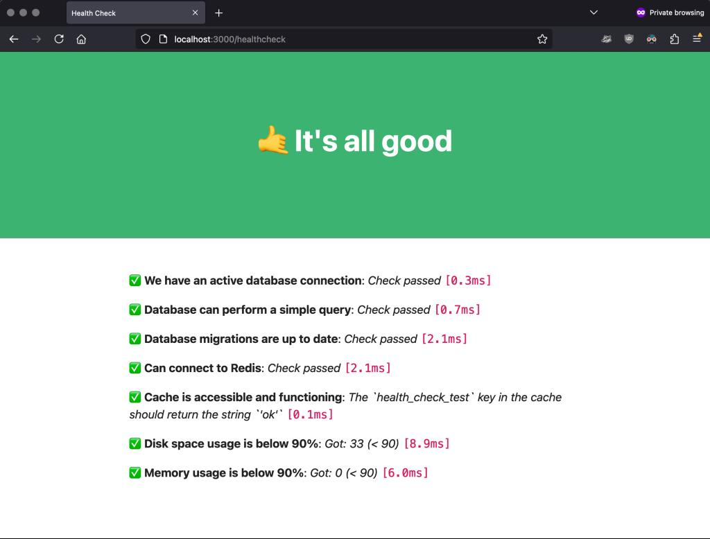

# ✅ Allgood - Rails gem for health checks

[](https://badge.fury.io/rb/allgood)

Add quick, simple, and beautiful health checks to your Rails application via a `/healthcheck` page.



## How it works

`allgood` allows you to define custom health checks (as in: can the Rails app connect to the DB, are there any new users in the past 24 hours, are they actually using the app, etc.) in a very intuitive way that reads just like English.

It provides a `/healthcheck` endpoint that displays the results in a beautiful page.

You can then [use that endpoint to monitor the health of your application via UptimeRobot](https://uptimerobot.com/?rid=854006b5fe82e4), Pingdom, etc. These services will load your `/healthcheck` page every few minutes, so all checks will be run when UptimeRobot fetches the page.

## Installation

Add this line to your application's Gemfile:
```ruby
gem 'allgood'
```

Then run `bundle install`.

After installing the gem, you need to mount the `/healthcheck` route and define your health checks in a `config/allgood.rb` file.


## Mount the `/healthcheck` route

In your `config/routes.rb` file, mount the Allgood engine:
```ruby
mount Allgood::Engine => '/healthcheck'
```

You can now navigate to `/healthcheck` to see the health check results.

The `/healthcheck` page returns HTTP codes:
 - `200 OK` if all checks are successful
 - `503 Service Unavailable` error otherwise

Services like UptimeRobot pick up these HTTP codes, which makes monitoring easy. `allgood` is also a nice replacement for the default `/up` Rails action, to make Kamal also check things like if the database connection is good. Just change the mounting route to `/up` instead of `/healthcheck`

> [!TIP]
> If you're using Kamal with `allgood`, container deployment will fail if any checks fail, [without feedback from Kamal](https://github.com/rameerez/allgood/issues/1) on what went wrong. To avoid this, you can either keep the `allgood.rb` file very minimal (e.g., only check for active DB connection, migrations up to date, etc.) so the app deployment succeeds, or you can use the default `/up` route for Kamal, and then mount `allgood` on another route for more advanced business-oriented checks. What you want to avoid is your app deployment failing because of you didn't get any users in the past hour, or something like that.

## Configure your health checks

Create a file `config/allgood.rb` in your Rails application. This is where you'll define your health checks. Here's a simple example:
```ruby
# config/allgood.rb

check "We have an active database connection" do
  make_sure ActiveRecord::Base.connection.connect! && ActiveRecord::Base.connection.active?
end
```

`allgood` will run all checks upon page load, and will show "Check passed" or "Check failed" next to it. That's it – add as many health checks as you want!

Here's my default `config/allgood.rb` file that should work for most Rails applications, feel free to use it as a starting point:

```ruby
# config/allgood.rb

check "We have an active database connection" do
  make_sure ActiveRecord::Base.connection.connect! && ActiveRecord::Base.connection.active?
end

check "Database can perform a simple query" do
  make_sure ActiveRecord::Base.connection.execute("SELECT 1").any?
end

check "Database migrations are up to date" do
  make_sure ActiveRecord::Migration.check_all_pending! == nil
end

check "Disk space usage is below 90%" do
  usage = `df -h / | tail -1 | awk '{print $5}' | sed 's/%//'`.to_i
  expect(usage).to_be_less_than(90)
end

check "Memory usage is below 90%" do
  usage = `free | grep Mem | awk '{print $3/$2 * 100.0}' | cut -d. -f1`.to_i
  expect(usage).to_be_less_than(90)
end
```

And if you're using Redis:
```ruby
check "Can connect to Redis" do
  make_sure Redis.new.ping == "PONG"
end

check "Cache is accessible and functioning" do
  Rails.cache.write('health_check_test', 'ok')
  make_sure Rails.cache.read('health_check_test') == 'ok', "The `health_check_test` key in the cache should return the string `'ok'`"
end
```

I've also added an example [`config/allgood.rb`](examples/allgood.rb) file in the `examples` folder that you can use as a starting point.

> ⚠️ Make sure to restart the Rails server every time you modify the `config/allgood.rb` file for the config to reload and the changes to apply.


### The `allgood` DSL

As you can see, there's a very simple DSL (Domain-Specific Language) you can use to define health checks. It reads almost like natural English, and allows you to define powerful yet simple checks to make sure your app is healthy.

For example, you can specify a custom human-readable success / error message for each check, so you don't go crazy when things fail and you can't figure out what the check expected output was:
```ruby
check "Cache is accessible and functioning" do
  Rails.cache.write('health_check_test', 'ok')
  make_sure Rails.cache.read('health_check_test') == 'ok', "The `health_check_test` key in the cache should contain `'ok'`"
end
```

Other than checking for an active database connection, it's useful to check for business-oriented metrics, such as whether your app has gotten any new users in the past 24 hours (to make sure your signup flow is not broken), check whether there have been any new posts / records created recently (to make sure your users are performing the actions you'd expect them to do in your app), check for recent purchases, check for external API connections, check whether new records contain values within expected range, etc.

Some business health check examples that you'd need to adapt to the specifics of your particular app:
```ruby
# Adapt these to your app specifics

check "There's been new signups in the past 24 hours" do
  count = User.where(created_at: 24.hours.ago..Time.now).count
  expect(count).to_be_greater_than(0)
end

check "The last created Purchase has a valid total" do
  last_purchase = Purchase.order(created_at: :desc).limit(1).first
  make_sure last_purchase.total.is_a?(Numeric), "Purchase total should be a number"
  expect(last_purchase.total).to_be_greater_than(0)
end
```

### Available check methods

- `make_sure(condition, message = nil)`: Ensures that the given condition is true.
- `expect(actual).to_eq(expected)`: Checks if the actual value equals the expected value.
- `expect(actual).to_be_greater_than(expected)`: Checks if the actual value is greater than the expected value.
- `expect(actual).to_be_less_than(expected)`: Checks if the actual value is less than the expected value.

Please help us develop by adding more expectation methods in the `Expectation` class!

## Customization

### Timeout

By default, each check has a timeout of 10 seconds.

## Development

After checking out the repo, run `bin/setup` to install dependencies. Then, run `rake spec` to run the tests. You can also run `bin/console` for an interactive prompt that will allow you to experiment.

To install this gem onto your local machine, run `bundle exec rake install`.

## Contributing

Bug reports and pull requests are welcome on GitHub at https://github.com/rameerez/allgood. Our code of conduct is: just be nice and make your mom proud of what you do and post online.

## License

The gem is available as open source under the terms of the [MIT License](https://opensource.org/licenses/MIT).
